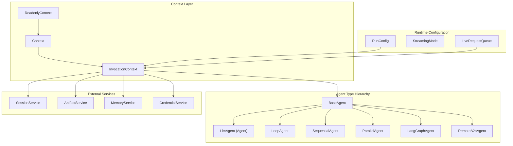
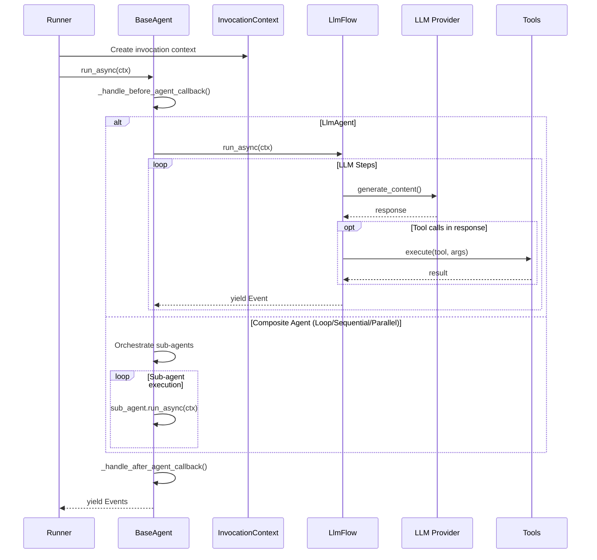
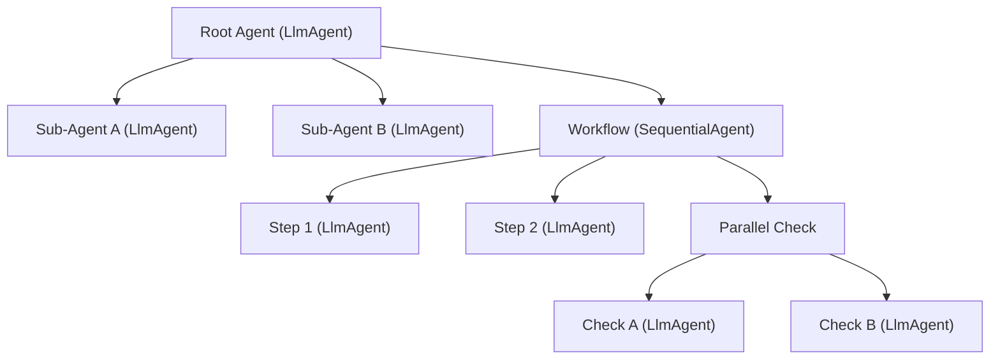

# Agents Module Architecture

This directory contains design documents for the `src/google/adk/agents/` module — the core agent abstraction layer of Google Agent Development Kit (ADK).

## Module Map

```
src/google/adk/agents/
├── base_agent.py             # BaseAgent — foundation for all agent types
├── llm_agent.py              # LlmAgent — LLM-powered agent with tools & callbacks
├── invocation_context.py     # InvocationContext — per-invocation execution state
├── context.py                # Context — read-write runtime context for callbacks/tools
├── readonly_context.py       # ReadonlyContext — read-only view of invocation state
├── loop_agent.py             # LoopAgent — iterative sub-agent execution
├── sequential_agent.py       # SequentialAgent — ordered sub-agent pipeline
├── parallel_agent.py         # ParallelAgent — concurrent sub-agent execution
├── langgraph_agent.py        # LangGraphAgent — LangGraph integration wrapper
├── remote_a2a_agent.py       # RemoteA2aAgent — Agent-to-Agent protocol client
├── run_config.py             # RunConfig — runtime behavior configuration
├── live_request_queue.py     # LiveRequestQueue — bidirectional streaming queue
├── mcp_instruction_provider.py  # McpInstructionProvider — MCP-based instructions
├── callback_context.py       # CallbackContext = Context alias (backward compat)
├── active_streaming_tool.py  # ActiveStreamingTool — streaming tool state
├── transcription_entry.py    # TranscriptionEntry — audio transcription data
├── context_cache_config.py   # ContextCacheConfig — LLM context caching settings
├── base_agent_config.py      # BaseAgentConfig — base YAML config for agents
├── llm_agent_config.py       # LlmAgentConfig — YAML config for LlmAgent
├── loop_agent_config.py      # LoopAgentConfig — YAML config for LoopAgent
├── sequential_agent_config.py# SequentialAgentConfig — YAML config for SequentialAgent
├── parallel_agent_config.py  # ParallelAgentConfig — YAML config for ParallelAgent
├── agent_config.py           # AgentConfig — discriminated union of all configs
├── common_configs.py         # Shared config types (ArgumentConfig, CodeConfig, etc.)
├── config_agent_utils.py     # Config resolution utilities
├── config_schemas/
│   └── AgentConfig.json      # JSON Schema for YAML config validation
└── __init__.py               # Public API exports
```

## High-Level Architecture



## Execution Flow



## Agent Tree Structure

ADK agents form a tree where the root agent owns the conversation. Sub-agents can be delegated to via LLM-controlled transfer or orchestrated by composite agents.



## Documents

| File | Covers |
|------|--------|
| [base_agent.md](base_agent.md) | `BaseAgent` — foundation class for all agents |
| [llm_agent.md](llm_agent.md) | `LlmAgent` — LLM-powered agent with tools & callbacks |
| [invocation_context.md](invocation_context.md) | `InvocationContext` — per-invocation execution state |
| [context.md](context.md) | `Context` + `ReadonlyContext` — runtime context for callbacks/tools |
| [loop_agent.md](loop_agent.md) | `LoopAgent` — iterative sub-agent execution |
| [sequential_agent.md](sequential_agent.md) | `SequentialAgent` — ordered sub-agent pipeline |
| [parallel_agent.md](parallel_agent.md) | `ParallelAgent` — concurrent isolated execution |
| [run_config.md](run_config.md) | `RunConfig` — runtime behavior & streaming configuration |
| [langgraph_agent.md](langgraph_agent.md) | `LangGraphAgent` — LangGraph integration |
| [remote_a2a_agent.md](remote_a2a_agent.md) | `RemoteA2aAgent` — Agent-to-Agent protocol |
| [live_request_queue.md](live_request_queue.md) | `LiveRequestQueue` — bidirectional streaming |
