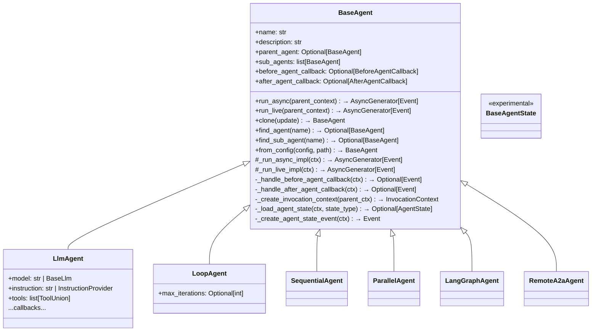
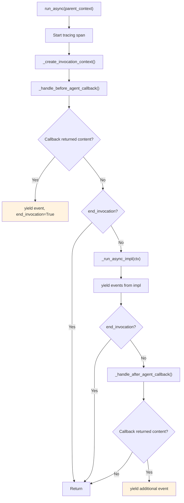
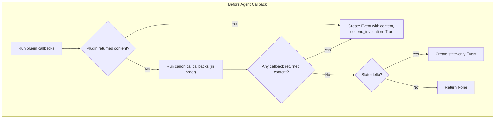
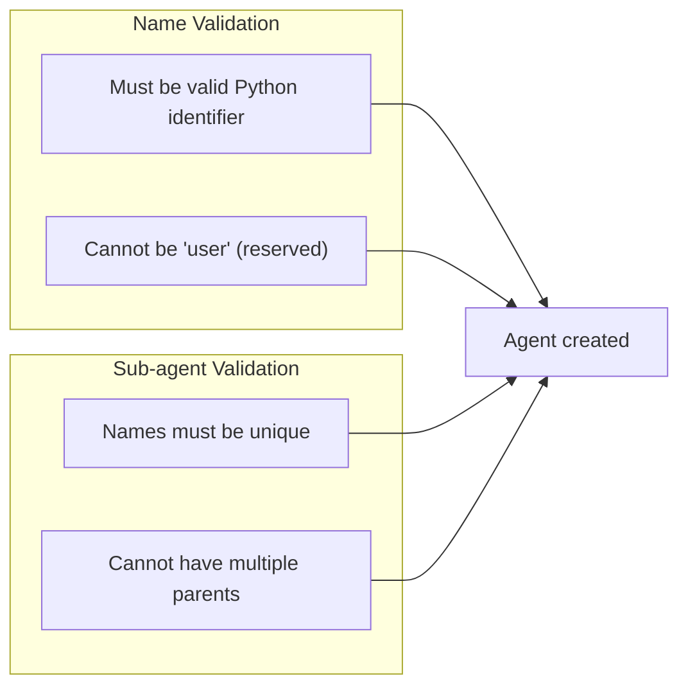
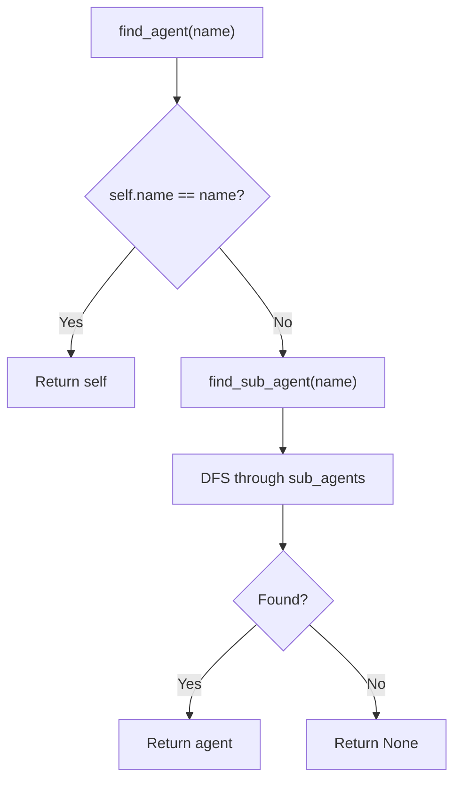
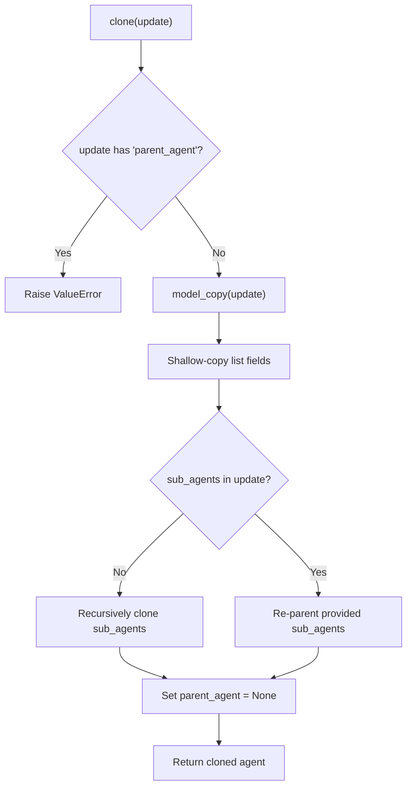
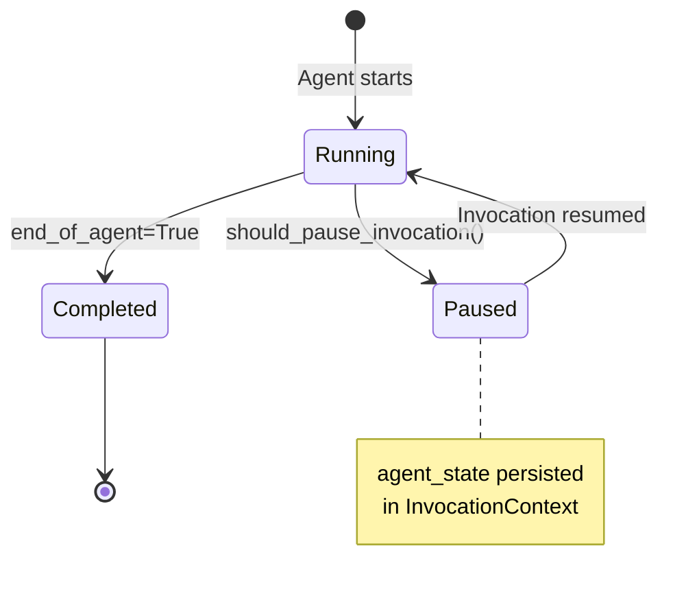

# BaseAgent — Foundation for All Agents

**Source:** `src/google/adk/agents/base_agent.py`

## Purpose

`BaseAgent` is the abstract base class for every agent type in ADK. It defines the agent tree structure (parent/child relationships), the callback lifecycle, agent state management for resumable execution, and the `run_async`/`run_live` entry points that all concrete agents must implement.

## Class Overview

## Agent Lifecycle — `run_async()`

The `run_async()` method is `@final` — subclasses cannot override it. Instead, they implement `_run_async_impl()`. This ensures the callback lifecycle is always respected.

The same pattern applies to `run_live()` for bidirectional streaming.

## Callback System

Key behaviors:
- Callbacks are called **in order** until one returns non-None content
- When a `before_agent_callback` returns content, the **agent run is skipped entirely**
- When an `after_agent_callback` returns content, it's **appended as an additional event**
- Both sync and async callbacks are supported (auto-awaited if async)
- Callback parameter must be named `callback_context` (enforced)

## Validation Rules

| Rule | Enforcement |
|------|-------------|
| Name is Python identifier | `@field_validator('name')` — raises `ValueError` |
| Name not `"user"` | `@field_validator('name')` — raises `ValueError` |
| Unique sub-agent names | `@field_validator('sub_agents')` — logs warning |
| Single parent constraint | `model_post_init` — raises `ValueError` if parent already set |

## Agent Tree Navigation

- `root_agent` property: Walks parent chain to find root
- `find_agent()`: Finds by name in self + descendants (DFS)
- `find_sub_agent()`: Finds by name in descendants only

## Clone Semantics

Clone creates a deep copy of the agent tree — sub-agents are recursively cloned to prevent shared state, and the cloned root has no parent.

## Agent State (Experimental)

`BaseAgentState` supports resumable execution for composite agents. State is serialized to JSON and stored in `InvocationContext.agent_states`.

## Configuration System

Each agent type has a corresponding config class for YAML-based agent definition:

| Agent | Config Class | Key Fields |
|-------|-------------|------------|
| `BaseAgent` | `BaseAgentConfig` | `name`, `description`, `sub_agents`, callbacks |
| `LlmAgent` | `LlmAgentConfig` | `model`, `instruction`, `tools`, schemas |
| `LoopAgent` | `LoopAgentConfig` | `max_iterations` |
| `SequentialAgent` | `SequentialAgentConfig` | (inherits base) |
| `ParallelAgent` | `ParallelAgentConfig` | (inherits base) |

The `from_config()` classmethod constructs agents from these configs, resolving sub-agent references, callbacks, and tool references.
