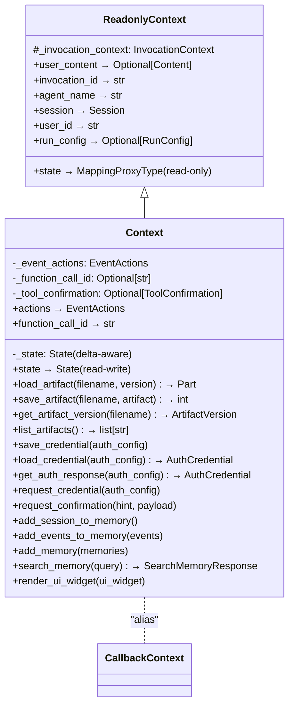
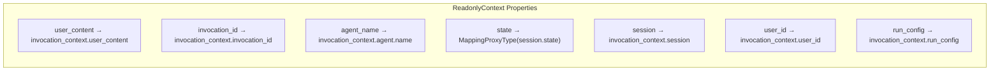
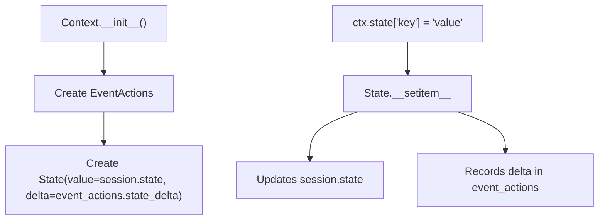
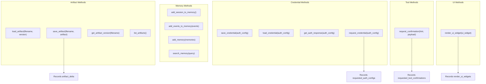
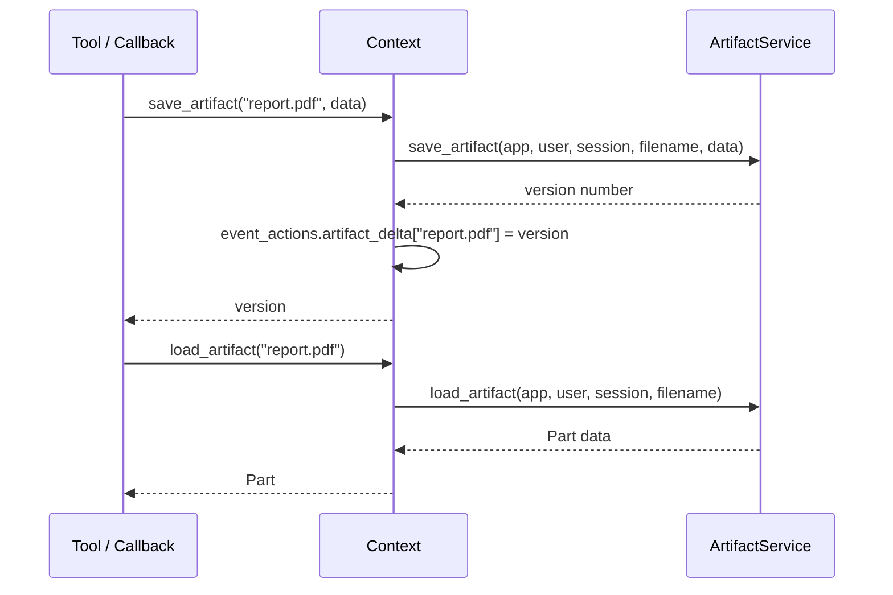
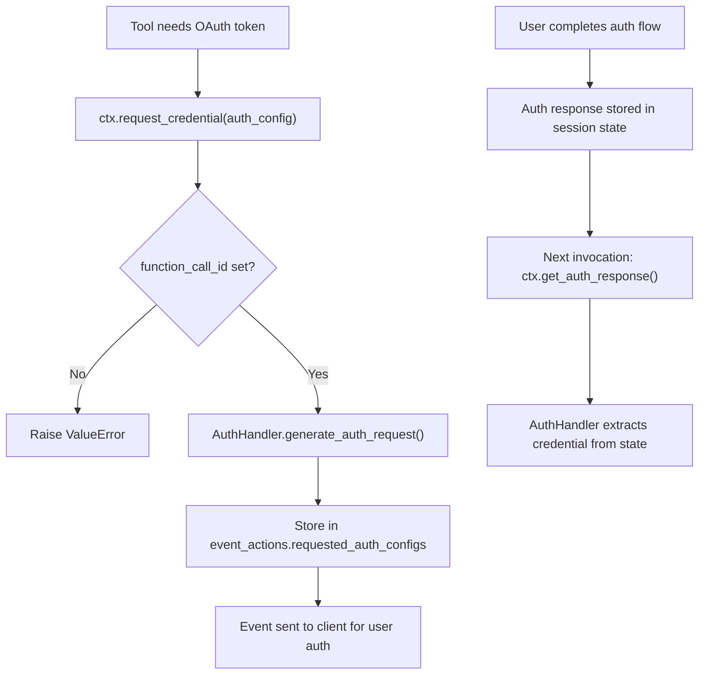
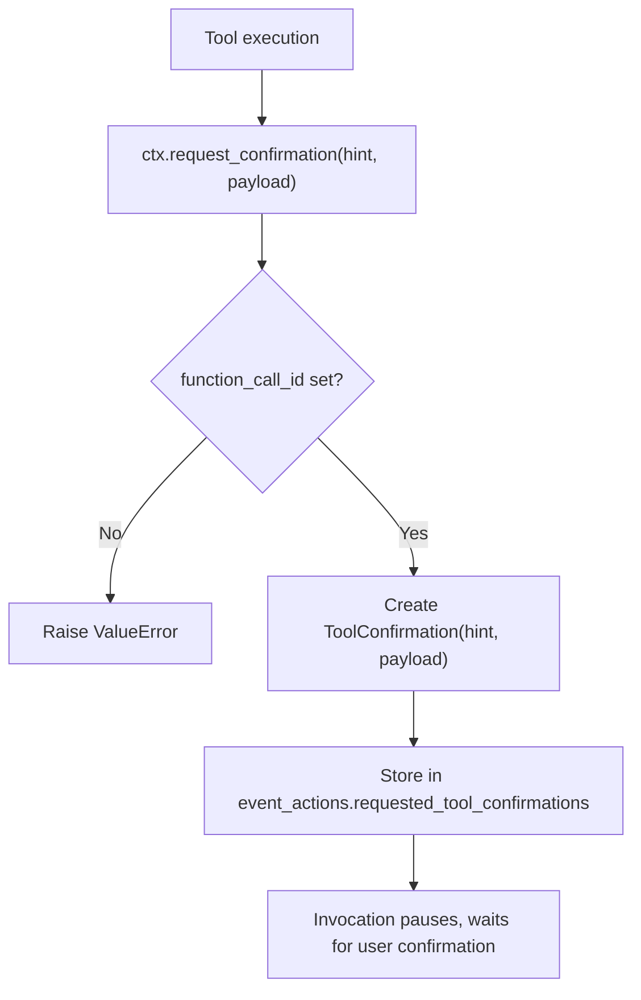
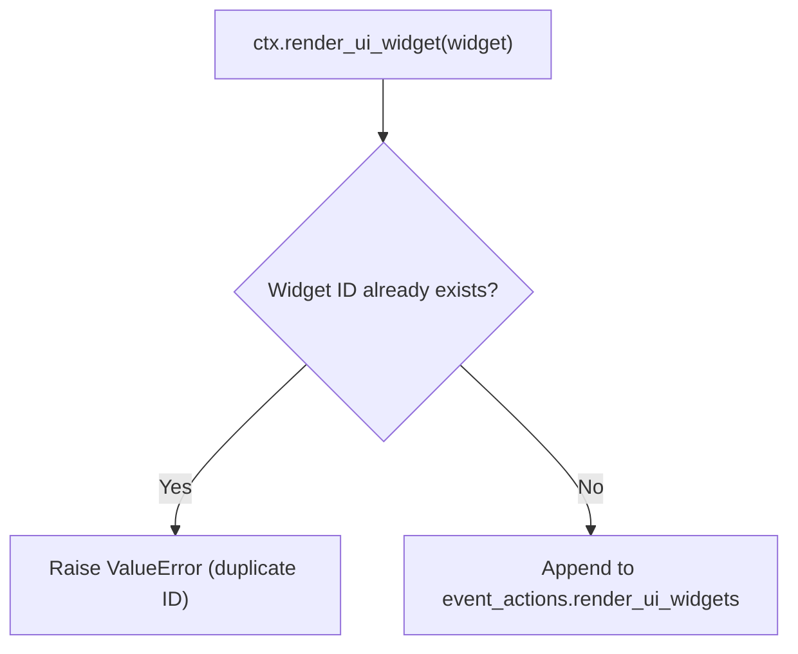

# Context & ReadonlyContext — Runtime Context for Callbacks and Tools

**Source:** `src/google/adk/agents/context.py`, `src/google/adk/agents/readonly_context.py`

## Purpose

`ReadonlyContext` provides a read-only view of invocation state for tools and instruction providers. `Context` extends it with mutation capabilities — state changes, artifact management, credential handling, memory operations, and UI widget rendering. Together they form the primary interface callbacks and tools use to interact with the runtime.

## Class Hierarchy

`CallbackContext` is a backward-compatible alias: `CallbackContext = Context`.

## ReadonlyContext — Read-Only View

The `state` property returns a `MappingProxyType` — a read-only dict wrapper that prevents mutations.

**Used by:** `InstructionProvider` callables, tool `get_tools_with_prefix()`.

## Context — Read-Write Operations

### State Management

The `State` object is a dict-like wrapper that tracks all mutations as a delta. These deltas are carried in `EventActions` and persisted with events.

### Capability Map

### Artifact Operations

### Credential Flow

Two paths:
- **Tool context** (`function_call_id` set): Use `request_credential()` for interactive OAuth
- **Callback context**: Use `save_credential()` / `load_credential()` for direct credential management

### Memory Operations

| Method | Purpose |
|--------|---------|
| `add_session_to_memory()` | Save entire current session to memory service |
| `add_events_to_memory(events)` | Save specific events to memory |
| `add_memory(memories)` | Save explicit `MemoryEntry` items |
| `search_memory(query)` | Search across stored memories |

All methods delegate to the configured `BaseMemoryService` and raise `ValueError` if no memory service is available.

### Tool Confirmation

### UI Widget Rendering

UI widgets provide rendering metadata for rich interactive components (e.g., MCP App iframes).

## Usage Contexts

| Context Type | Used By | State Access |
|-------------|---------|-------------|
| `ReadonlyContext` | `InstructionProvider`, `BaseToolset.get_tools_with_prefix()` | Read-only |
| `Context` (as `CallbackContext`) | `before/after_agent_callback` | Read-write (no function_call_id) |
| `Context` (as `ToolContext` subclass) | Tool execution | Read-write (with function_call_id) |
