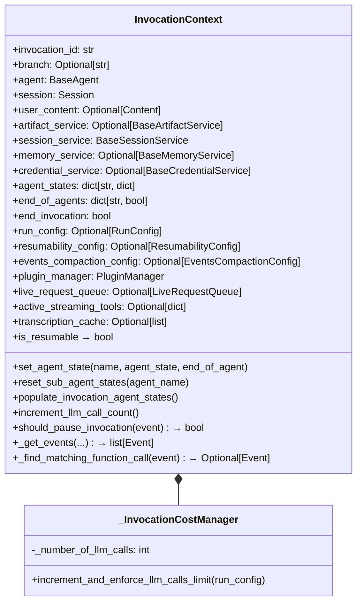
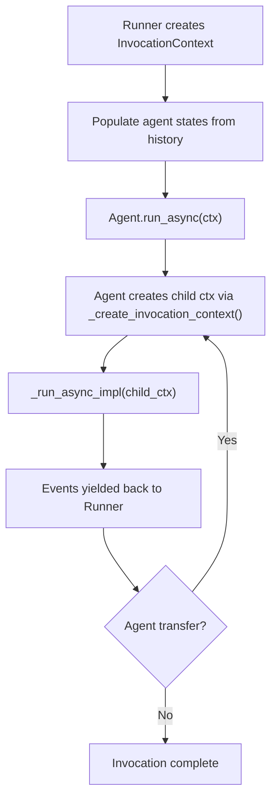
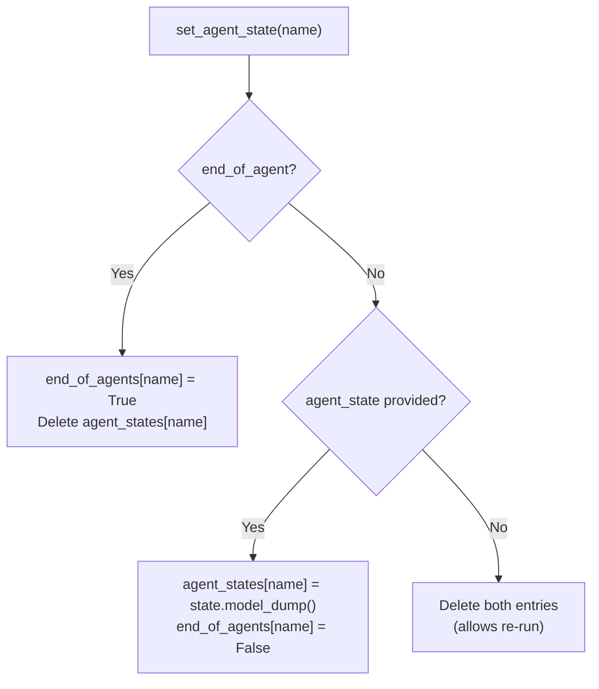
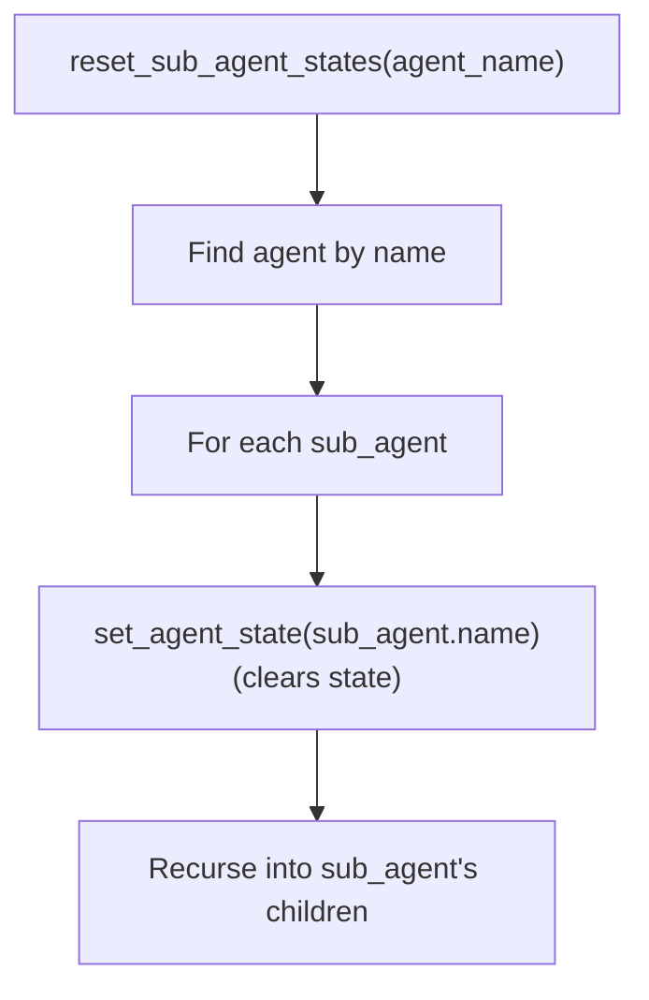
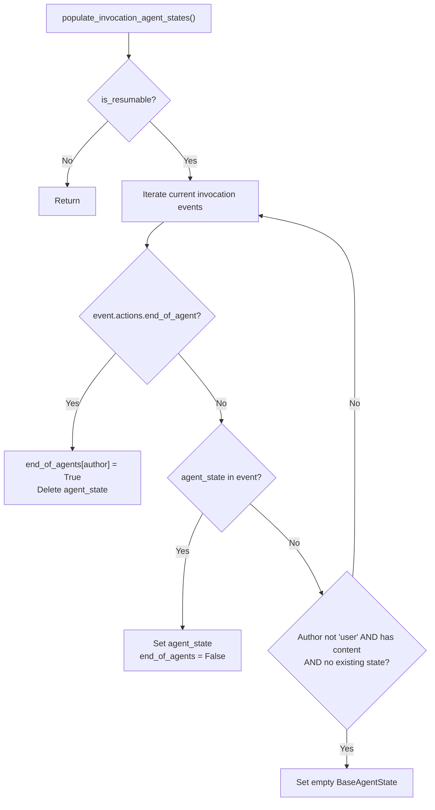
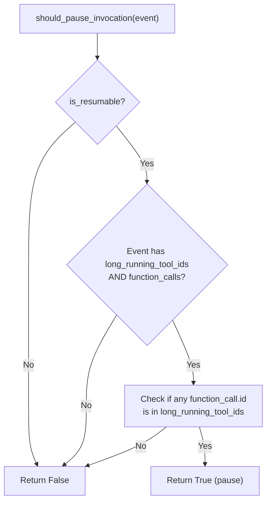
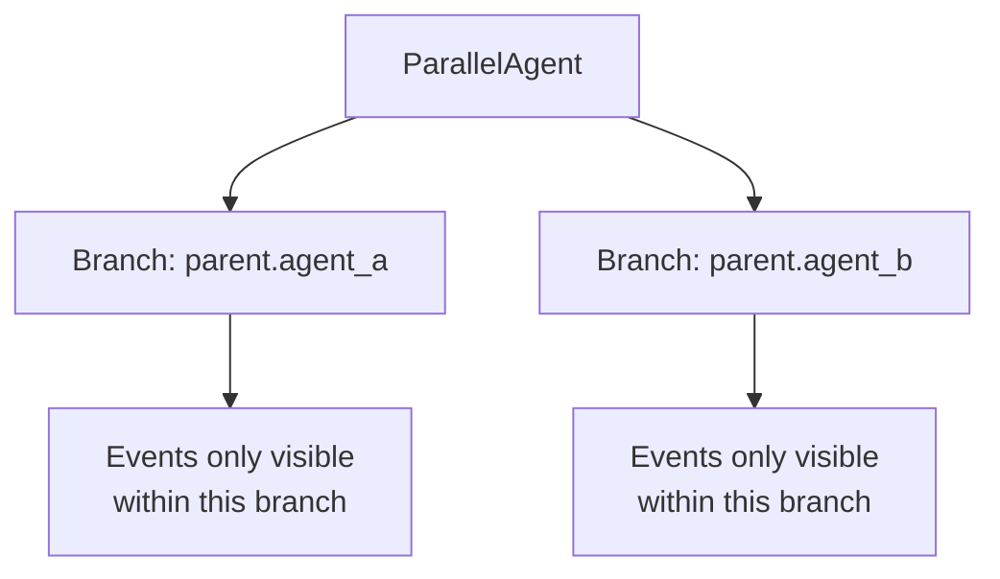
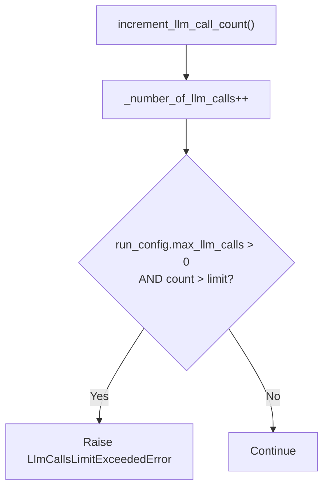
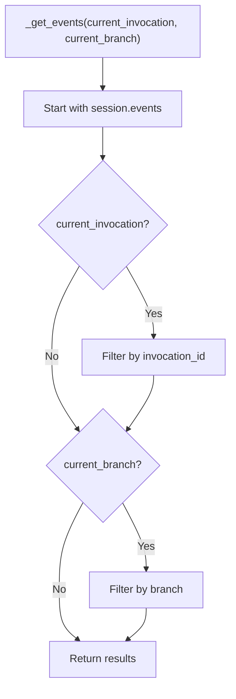

# InvocationContext — Per-Invocation Execution State

**Source:** `src/google/adk/agents/invocation_context.py`

## Purpose

`InvocationContext` holds all the mutable and immutable state for a single invocation — from the user message through final response. It carries service references, session data, agent states for resumability, cost tracking, and configuration. Every agent in the call chain receives its own view of this context.

## Class Overview



## Invocation Lifecycle



## Invocation Structure

The docstring defines the precise execution model:

```
┌─────────────────────── invocation ──────────────────────────┐
┌──────────── llm_agent_call_1 ────────────┐ ┌─ agent_call_2 ─┐
┌──── step_1 ────────┐ ┌───── step_2 ──────┐
[call_llm] [call_tool] [call_llm] [transfer]
```

| Concept | Scope |
|---------|-------|
| **Invocation** | User message → final response. Contains 1+ agent calls. |
| **Agent call** | Single `agent.run()` execution. Ends when `run()` returns. |
| **Step** | One LLM call + its tool executions. |

## Agent State Management





## Resumability



### Pause vs End



- **Pausing**: Invocation suspends, can resume later. Agent state is preserved.
- **Ending**: Invocation terminates. `end_invocation = True`.

## Branching

The `branch` field isolates parallel sub-agents from seeing each other's events:



Format: `parent_agent.sub_agent` (dot-separated ancestry).

## LLM Call Cost Tracking



Default limit: **500 LLM calls** per invocation (configurable via `RunConfig.max_llm_calls`).

## Event Filtering



## Key Properties

| Property | Source |
|----------|--------|
| `is_resumable` | `resumability_config.is_resumable` |
| `app_name` | `session.app_name` |
| `user_id` | `session.user_id` |
