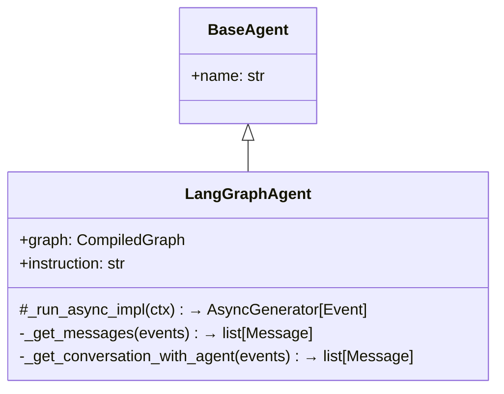
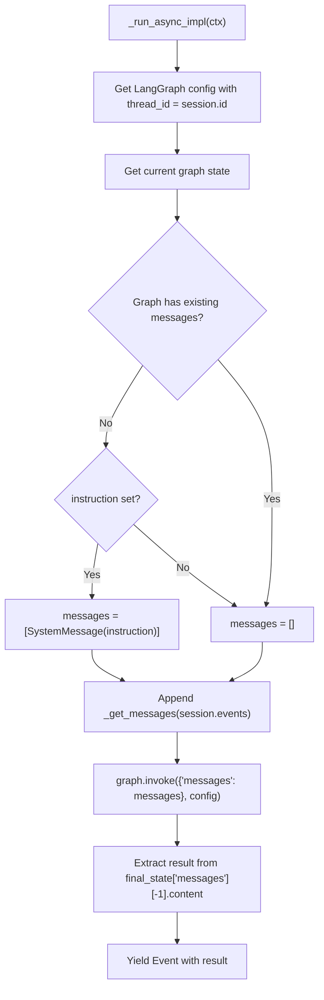
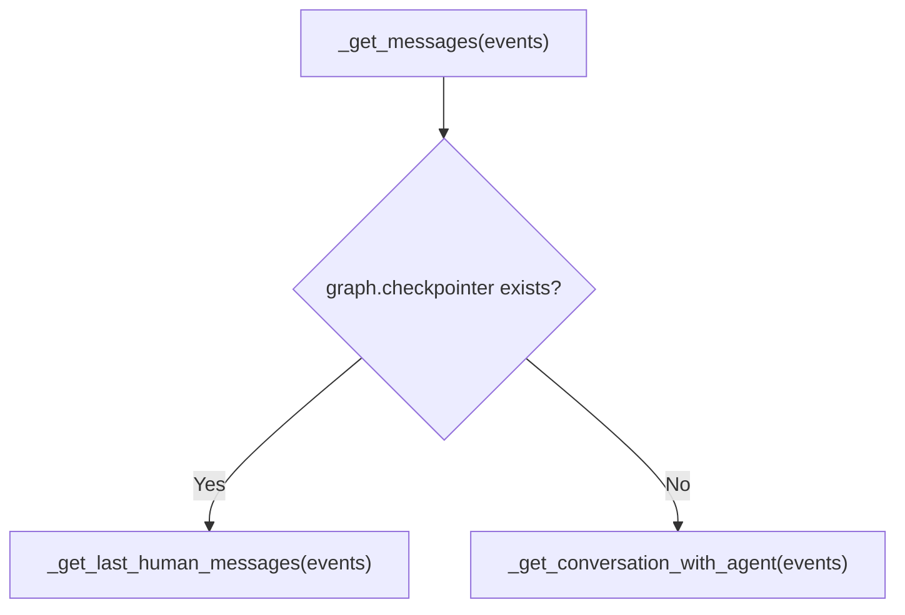
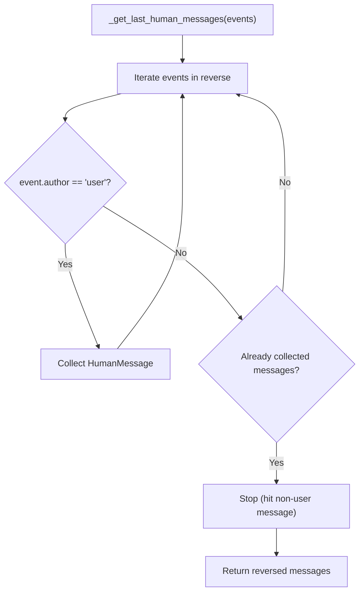
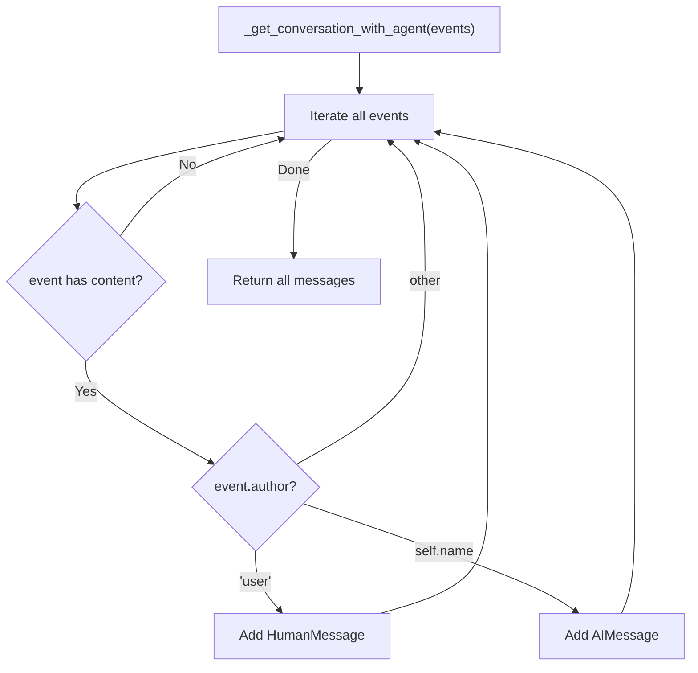
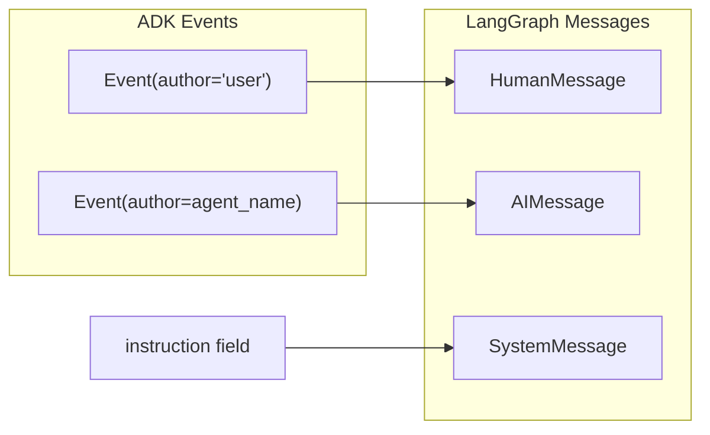
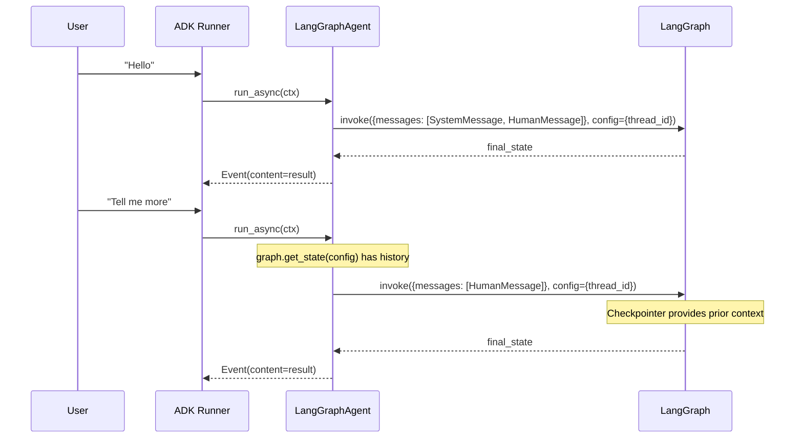

# LangGraphAgent — LangGraph Integration

**Source:** `src/google/adk/agents/langgraph_agent.py`

## Purpose

`LangGraphAgent` wraps a LangGraph `CompiledGraph` to run within the ADK agent framework. It bridges LangGraph's message-based execution with ADK's event-based system, supporting both single-turn and multi-turn conversations via LangGraph's checkpointer.

## Class Overview

## Execution Flow

## Message Extraction Strategy

The agent uses two different strategies depending on whether the LangGraph graph has its own checkpointer:

### With Checkpointer (LangGraph manages memory)

Only the **last consecutive user messages** are sent — the graph's checkpointer has the full history.

### Without Checkpointer (ADK manages memory)

The **full conversation** between user and this specific agent is sent — other agents' messages are filtered out.

## ADK ↔ LangGraph Type Mapping

## Multi-Turn Support

The `thread_id` is set to `session.id`, giving each ADK session its own LangGraph conversation thread.

## Limitations

- **Concept implementation** — the class docstring notes this is currently a concept
- Only extracts `text` from the first part of event content
- No support for tool calls, function responses, or multi-part content
- `_run_live_impl` is not implemented (inherits `NotImplementedError` from `BaseAgent`)
- Requires `langchain_core` and `langgraph` as dependencies
