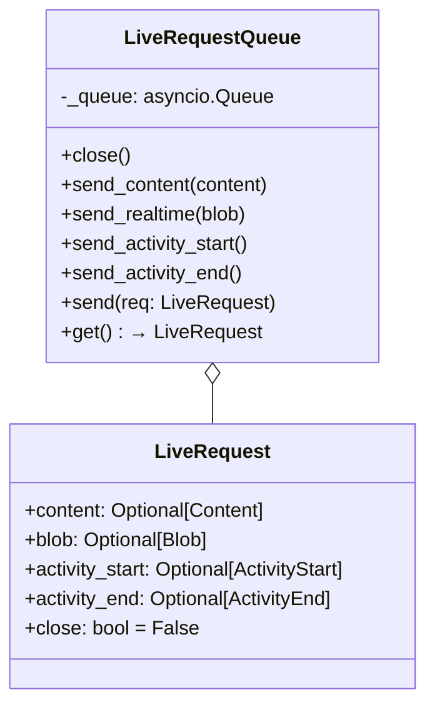
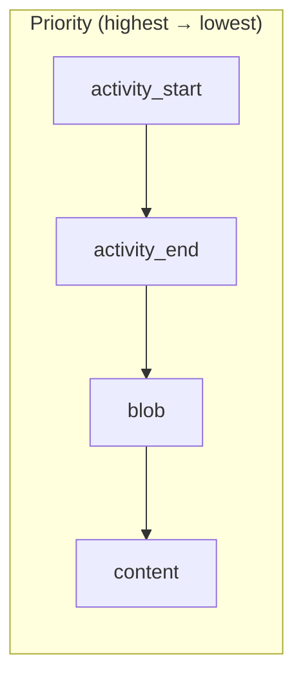
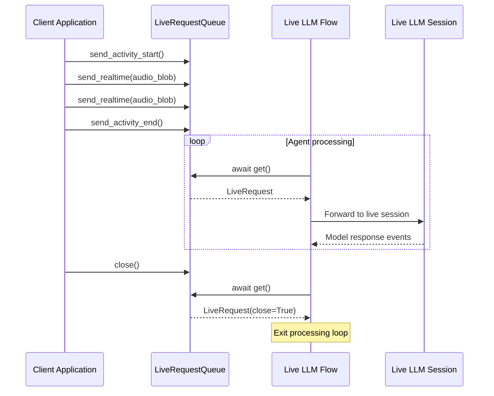
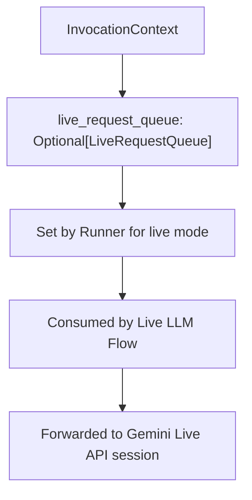

# LiveRequestQueue — Bidirectional Streaming Queue

**Source:** `src/google/adk/agents/live_request_queue.py`

## Purpose

`LiveRequestQueue` provides an async queue for bidirectional (live) streaming between a client and an agent. It wraps `asyncio.Queue` with typed methods for sending content, audio/video blobs, and activity signals. This is the primary interface for pushing real-time user input into a live agent session.

## Class Overview

## Request Types and Priority

When multiple fields are set in a `LiveRequest`, they are processed by priority:

| Method | Creates | Use Case |
|--------|---------|----------|
| `send_content(content)` | `LiveRequest(content=...)` | Turn-by-turn text/content messages |
| `send_realtime(blob)` | `LiveRequest(blob=...)` | Audio/video streaming data |
| `send_activity_start()` | `LiveRequest(activity_start=ActivityStart())` | Signal user started speaking/typing |
| `send_activity_end()` | `LiveRequest(activity_end=ActivityEnd())` | Signal user stopped speaking/typing |
| `close()` | `LiveRequest(close=True)` | Terminate the queue |

## Data Flow

## Queue Semantics

- **Non-blocking sends**: All `send_*` methods use `put_nowait()` — they never block the caller
- **Blocking receive**: `get()` is async and awaits the next request
- **Close signal**: `close()` enqueues a sentinel `LiveRequest(close=True)` — consumers check this to exit
- **No Python 3.13 shutdown**: The `close` field is a workaround since `queue.shutdown()` requires Python 3.13+

## Integration with InvocationContext

The queue is attached to `InvocationContext.live_request_queue` and is the link between external input and the live flow processing loop.
