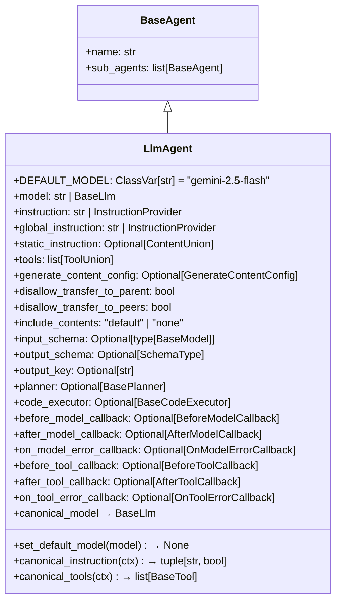
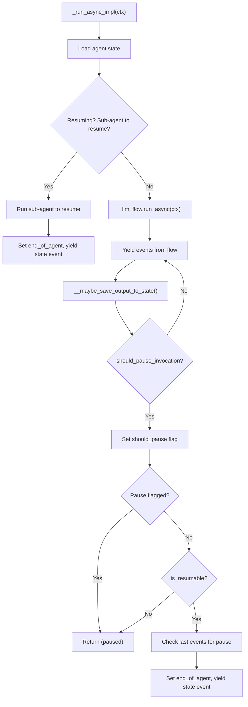
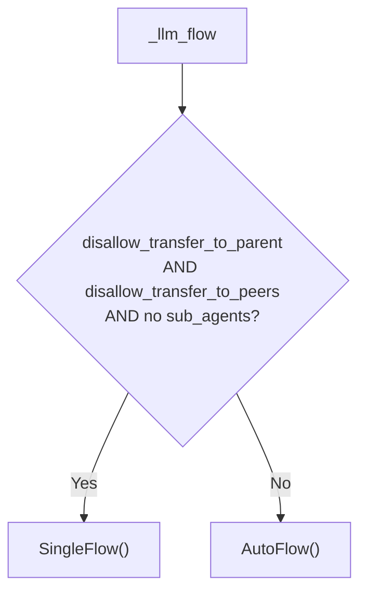
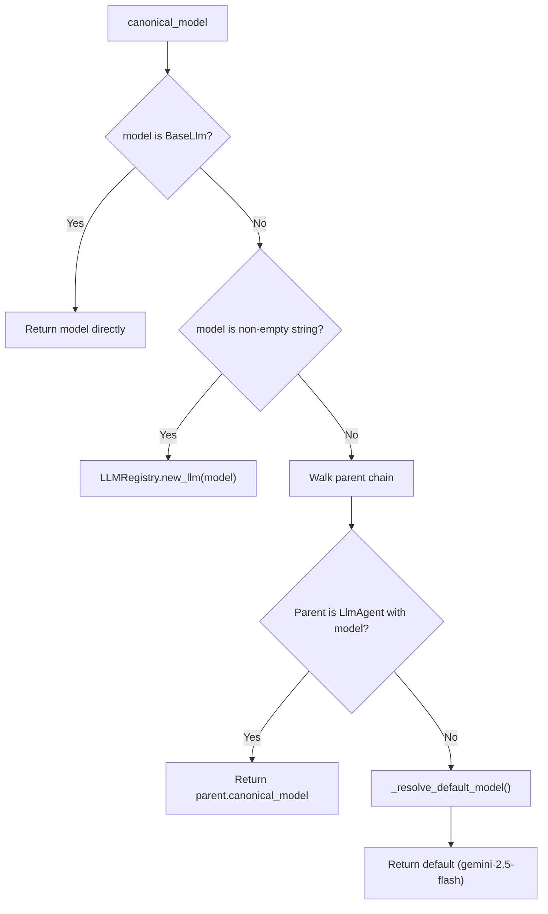
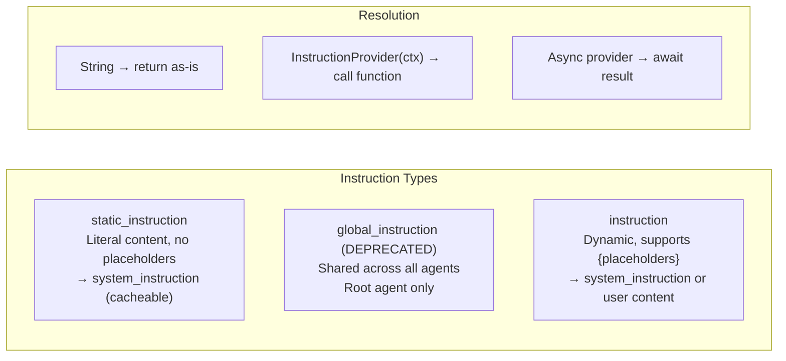
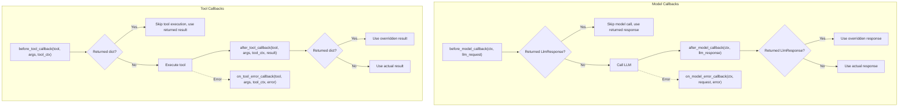
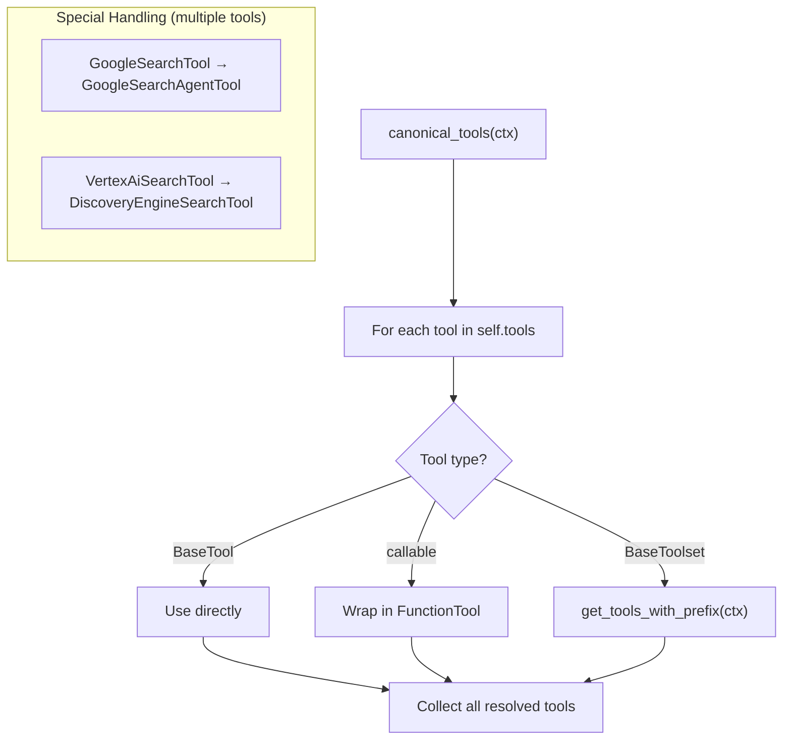
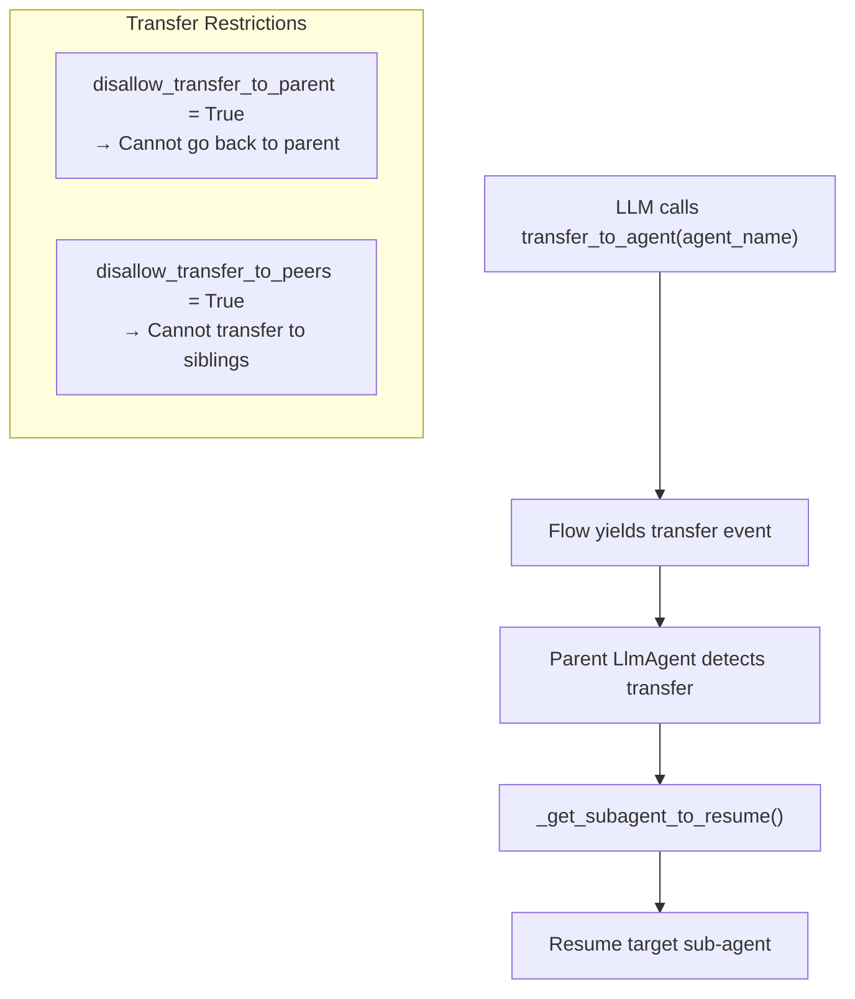
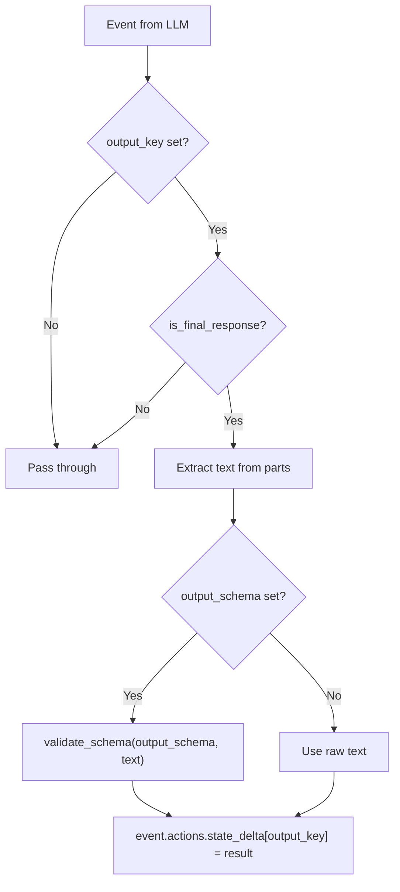

# LlmAgent — LLM-Powered Agent

**Source:** `src/google/adk/agents/llm_agent.py`

## Purpose

`LlmAgent` (aliased as `Agent`) is the primary agent type in ADK. It wraps an LLM model with tools, instructions, callbacks, and transfer capabilities. It delegates execution to an LLM flow that handles the reason-act loop — calling the model, executing tools, and managing agent transfers.

## Class Overview

## Execution Flow

## LLM Flow Selection

The `_llm_flow` property determines which execution flow to use based on agent configuration:

| Flow | When Used | Behavior |
|------|-----------|----------|
| `SingleFlow` | No transfers possible, no sub-agents | Simple LLM loop without transfer tools |
| `AutoFlow` | Default | Adds `transfer_to_agent` tool, manages agent routing |

## Model Resolution

The model resolution chain: **agent's own model → ancestor agent's model → class default model**.

`set_default_model()` overrides the class-level default for all agents.

## Instruction System

### Instruction Placement Logic

| `static_instruction` | `instruction` goes to |
|---|---|
| `None` | `system_instruction` |
| Set | User content (after static content) |

This separation enables context caching — static content at the front of the prompt is cacheable while dynamic instructions change per request.

## Callback Pipeline

All callbacks support single function or list of functions. When a list is provided, callbacks execute in order until one returns non-None.

## Tool Resolution

Tool resolution runs concurrently via `asyncio.gather` for all tool unions.

## Agent Transfer

When sub-agents exist and transfers are allowed, the LLM flow adds a `transfer_to_agent` tool:

## Output Schema & State

When `output_schema` is set, the agent can **only reply** — no tools, transfers, or sub-agents.

## Validation Rules

| Rule | Enforcement |
|------|-------------|
| `generate_content_config.tools` must be empty | Raises `ValueError` — use `LlmAgent.tools` instead |
| `generate_content_config.system_instruction` must be empty | Raises `ValueError` — use `LlmAgent.instruction` |
| `generate_content_config.response_schema` must be empty | Raises `ValueError` — use `LlmAgent.output_schema` |
| Dual thinking config warning | `model_post_init` warns if both `generate_content_config.thinking_config` and `planner.thinking_config` are set |
