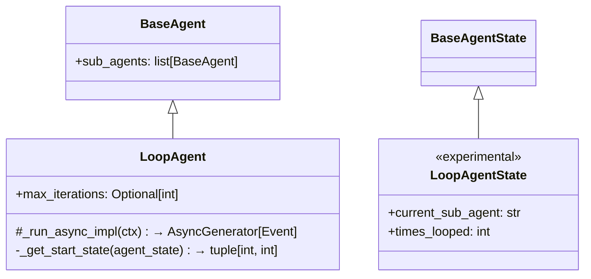
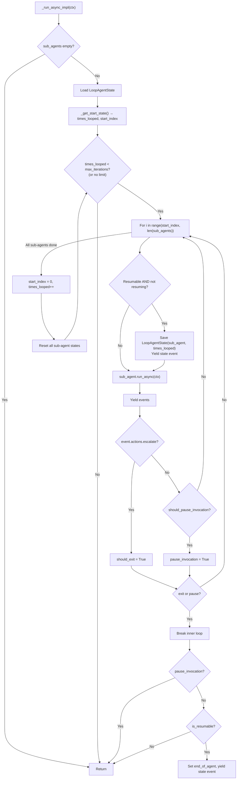
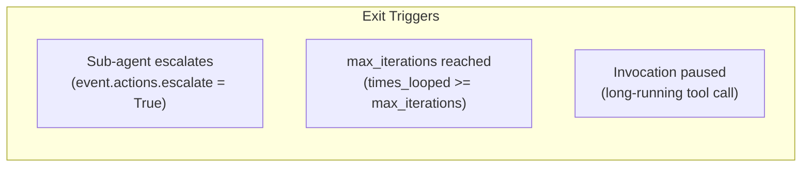
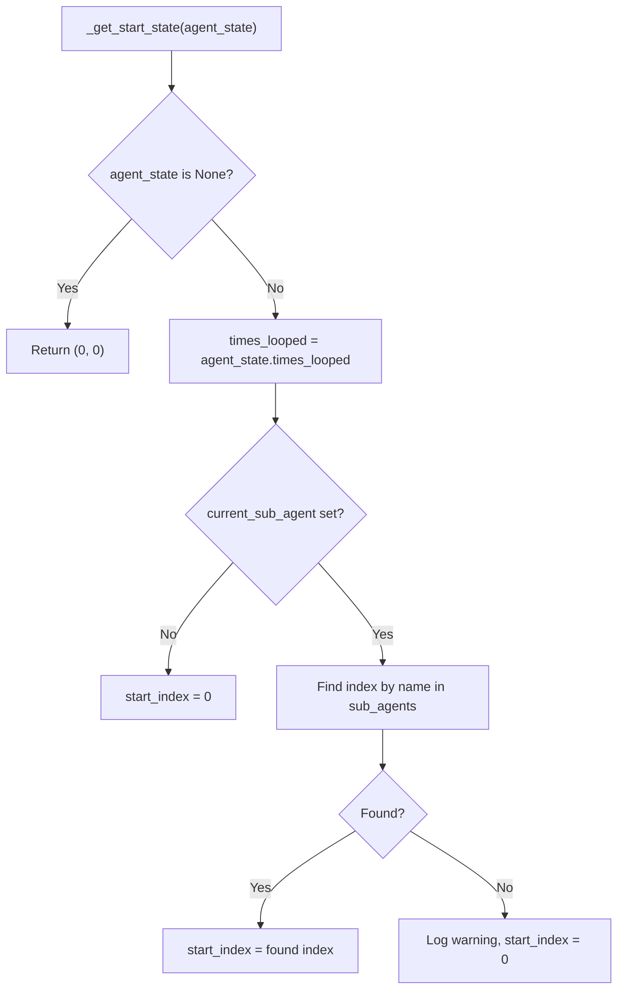
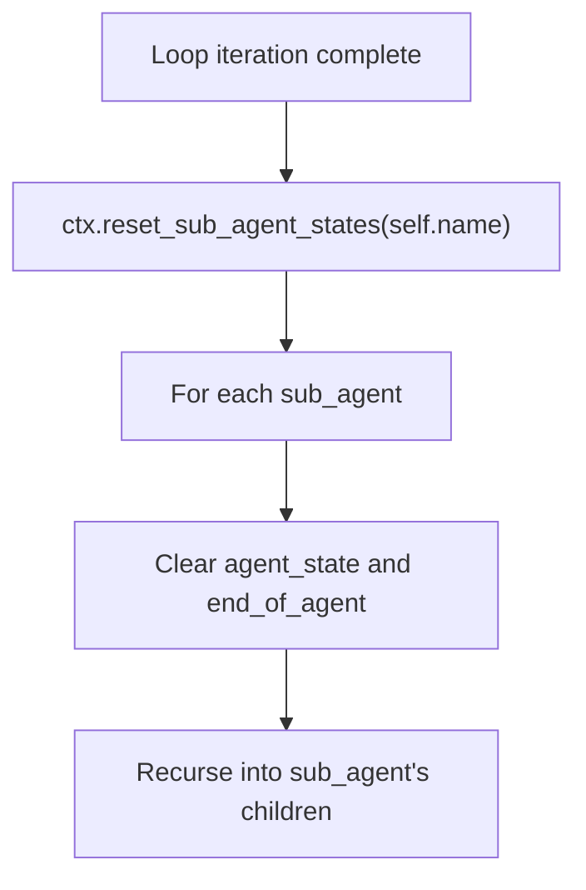

# LoopAgent — Iterative Sub-Agent Execution

**Source:** `src/google/adk/agents/loop_agent.py`

## Purpose

`LoopAgent` repeatedly runs its sub-agents in sequence until either a sub-agent escalates or `max_iterations` is reached. It supports resumable execution with state tracking for the current sub-agent and loop count.

## Class Overview



## Execution Flow



## Loop Termination Conditions



| Condition | Behavior |
|-----------|----------|
| Sub-agent escalates | Breaks out of loop immediately |
| `max_iterations` reached | Exits loop naturally |
| `max_iterations` not set | Runs indefinitely until escalation |
| Invocation pause | Returns without yielding end state |

## Resume from State



When resuming:
1. Skip already-completed iterations via `times_looped`
2. Resume from the specific sub-agent via `start_index`
3. If a sub-agent was removed, restart from beginning

## Sub-Agent State Reset

After each complete loop iteration, all sub-agent states are reset:



This ensures each loop iteration starts with fresh sub-agent state.

## Example Usage

```python
loop_agent = LoopAgent(
    name="review_loop",
    max_iterations=3,
    sub_agents=[
        Agent(name="writer", instruction="Write content..."),
        Agent(name="reviewer", instruction="Review and escalate if good..."),
    ],
)
```

The reviewer agent can call `escalate()` to break out of the loop when the content meets quality standards.

## Live Mode

`_run_live_impl` raises `NotImplementedError` — live mode is not supported for LoopAgent.
