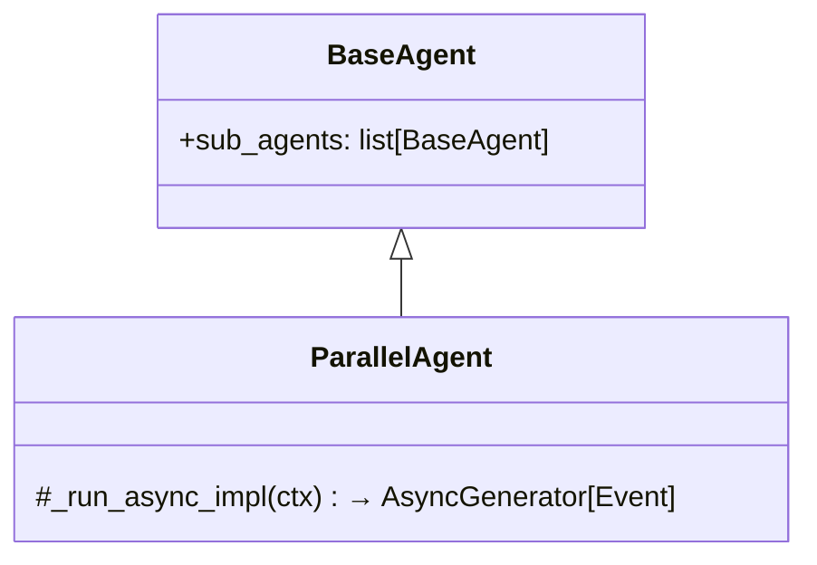
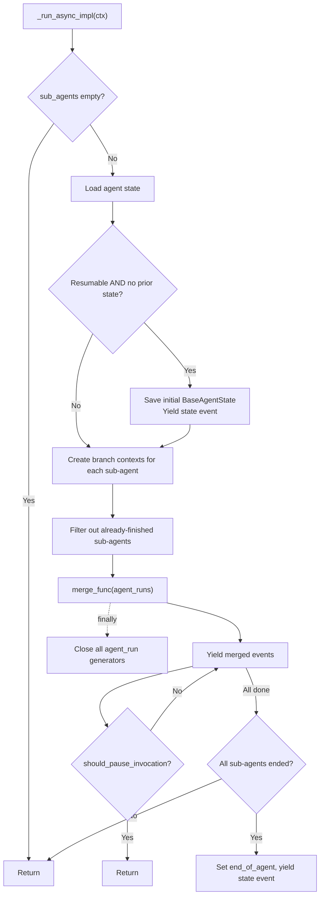
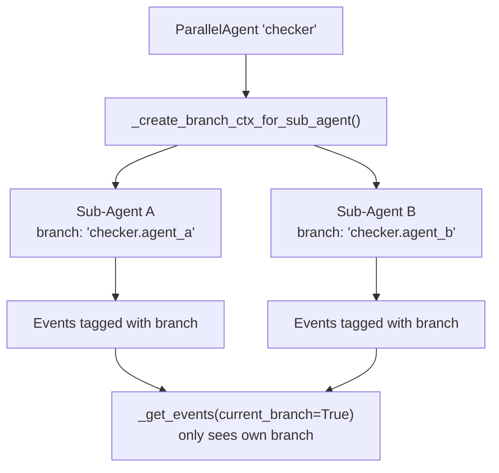
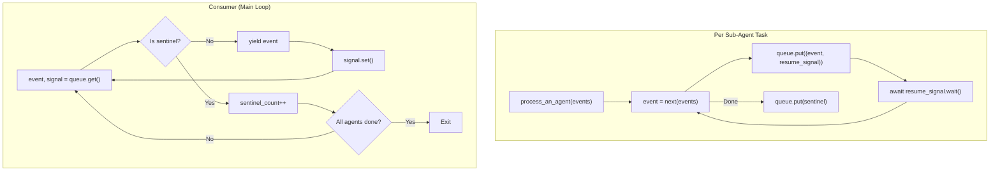
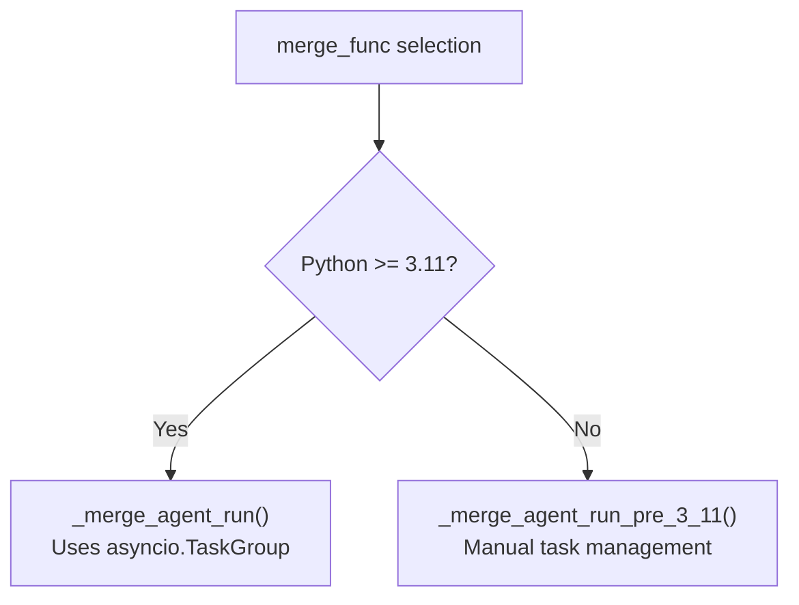

# ParallelAgent — Concurrent Isolated Execution

**Source:** `src/google/adk/agents/parallel_agent.py`

## Purpose

`ParallelAgent` runs all its sub-agents concurrently with isolated branches. Each sub-agent operates in its own context branch, preventing cross-contamination of conversation history. Events are merged back via an async queue with backpressure control.

## Class Overview



## Execution Flow



## Branch Isolation



Each sub-agent gets an isolated `InvocationContext` with a unique branch path. The branch format is `{parent_branch}.{parent_name}.{sub_agent_name}`.

## Event Merging — Queue-Based Backpressure



Key design:
- Each sub-agent runs as an asyncio task, putting events on a shared queue
- After putting an event, the producer **waits** for the consumer to signal completion
- This ensures backpressure — sub-agents don't run ahead of event processing
- A sentinel object marks when a sub-agent finishes

## Python Version Compatibility



| Version | Implementation | Error Handling |
|---------|---------------|----------------|
| Python 3.11+ | `asyncio.TaskGroup` context manager | Automatic cancellation on error |
| Python 3.10 | Manual `asyncio.create_task` + cleanup | Explicit cancellation in `finally` block, `propagate_exceptions()` check |

## Resumability

```mermaid
flowchart TD
    A["Resuming ParallelAgent"] --> B["Load agent states"]
    B --> C["For each sub_agent"]
    C --> D{end_of_agents[sub_agent.name]?}
    D -- Yes --> E["Skip (already finished)"]
    D -- No --> F["Include in agent_runs"]

    G["All sub-agents finished?"] --> H["Set end_of_agent for ParallelAgent"]
```

On resume, only sub-agents that haven't completed are re-run. The ParallelAgent marks itself as `end_of_agent` only when all sub-agents have individually finished.

## Resource Cleanup

The `finally` block in `_run_async_impl` ensures all async generator resources are properly closed:

```python
finally:
    for sub_agent_run in agent_runs:
        await sub_agent_run.aclose()
```

This prevents resource leaks even if the parent cancels execution.

## Live Mode

`_run_live_impl` raises `NotImplementedError` — parallel live streaming is not supported.
