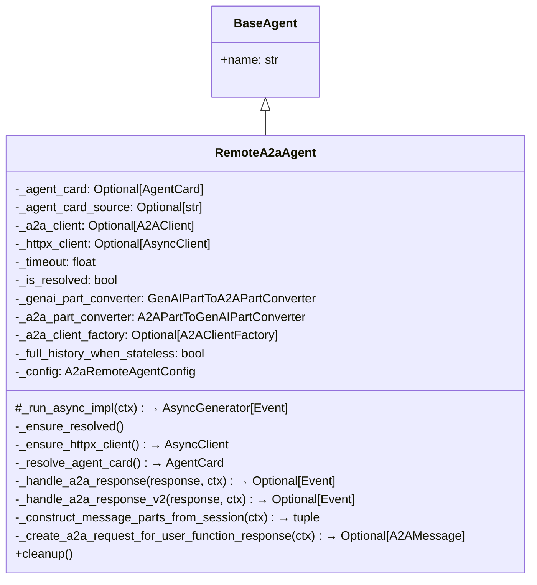
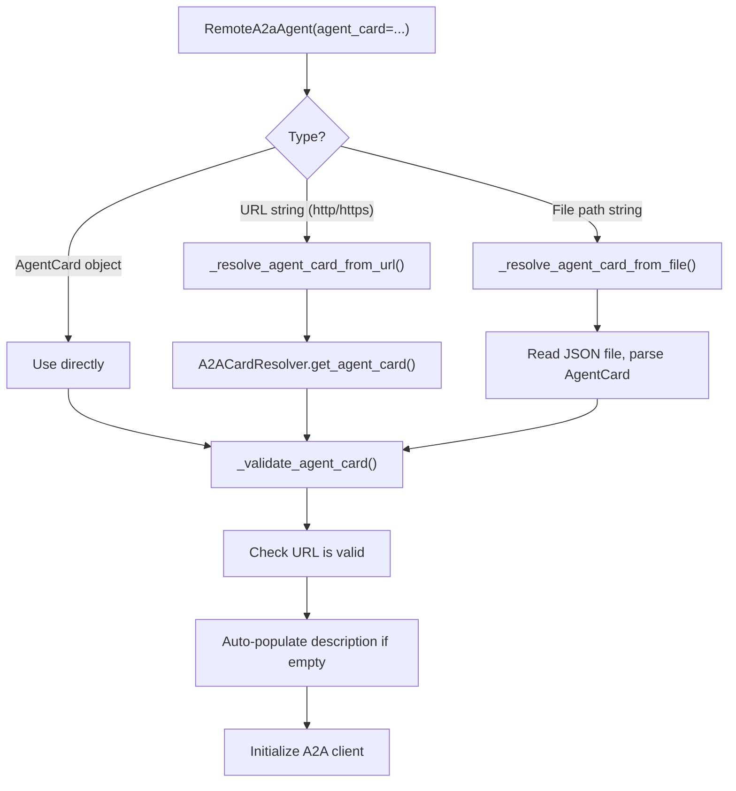
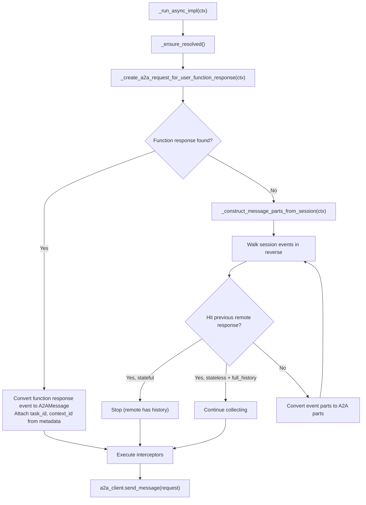
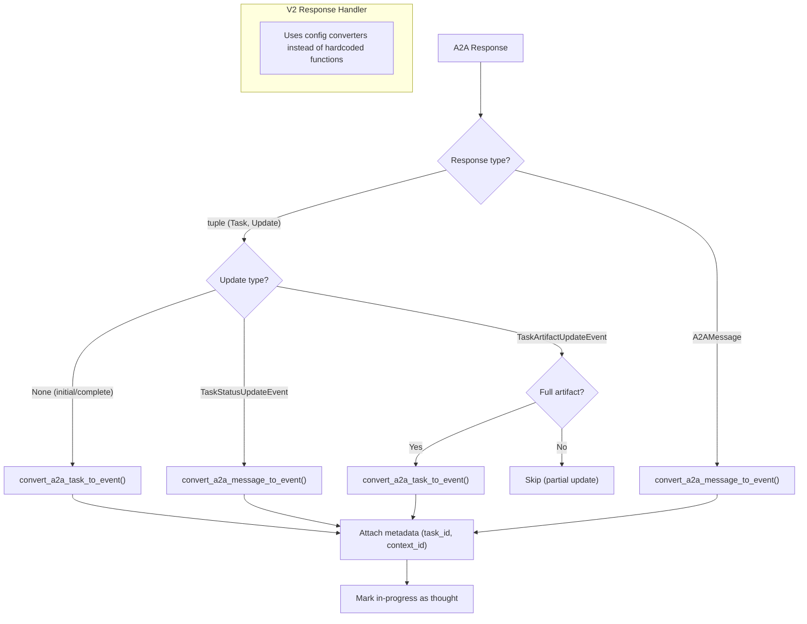
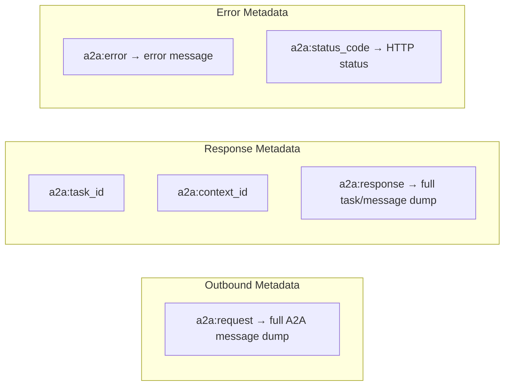
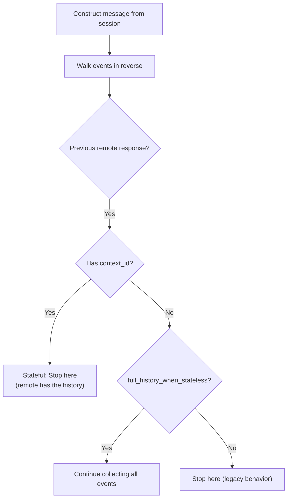
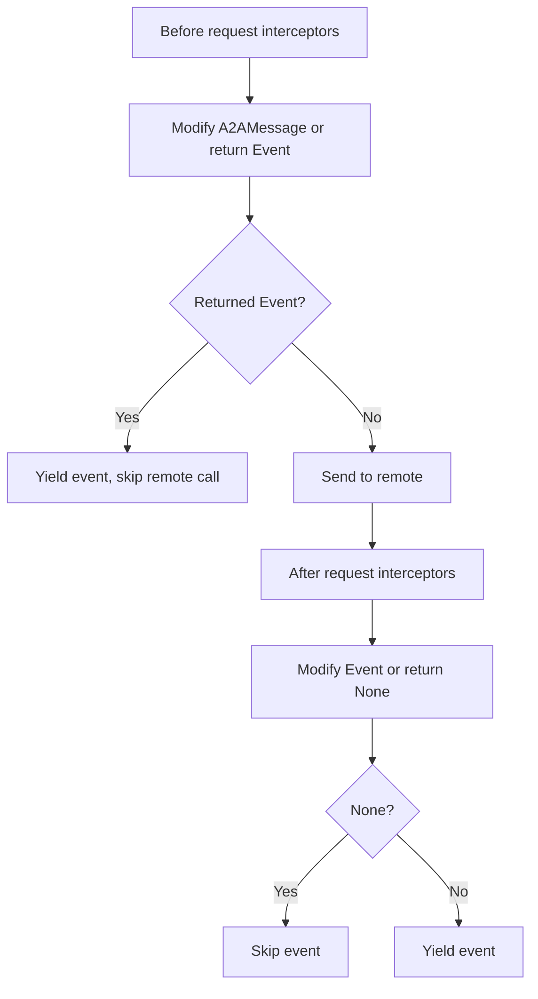
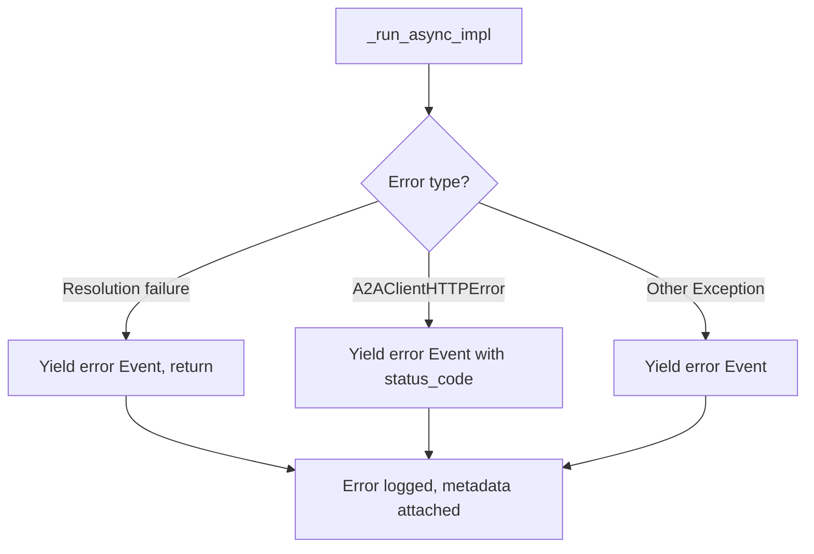
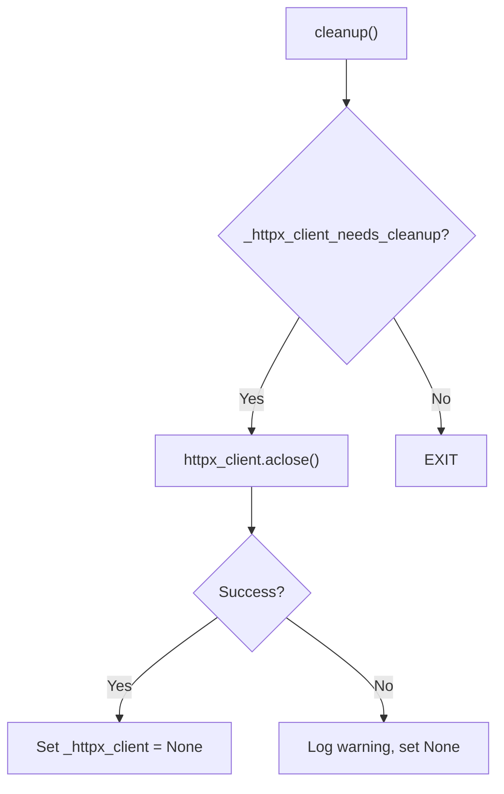

# RemoteA2aAgent — Agent-to-Agent Protocol Client

**Source:** `src/google/adk/agents/remote_a2a_agent.py`

## Purpose

`RemoteA2aAgent` enables an ADK agent to communicate with remote agents via the Agent-to-Agent (A2A) protocol. It handles agent card resolution, HTTP client management, message conversion between ADK events and A2A messages, streaming responses, and session state tracking across requests.

## Class Overview

## Agent Card Resolution

The agent card can be provided in three ways:

Resolution is lazy — happens on first `_run_async_impl` call.

## Request Construction

## Response Handling

### Streaming Task States

| Task State | Event Treatment |
|-----------|----------------|
| `submitted` / `working` | Parts marked as `thought=True` |
| `completed` | Normal content |
| Artifact update (full) | Converted to event |
| Artifact update (partial) | Skipped |

## Metadata Flow

All metadata is stored in `event.custom_metadata` with the `a2a:` prefix.

## Stateful vs Stateless Agents

## Interceptor Pipeline

The `use_legacy=False` flag injects a `_new_integration_extension_interceptor` that signals the server to use the new integration path.

## Error Handling

## Resource Cleanup

The HTTP client is only cleaned up if the agent created it (not if it was injected externally).

## Live Mode

`_run_live_impl` raises `NotImplementedError` — live A2A streaming is not supported.
