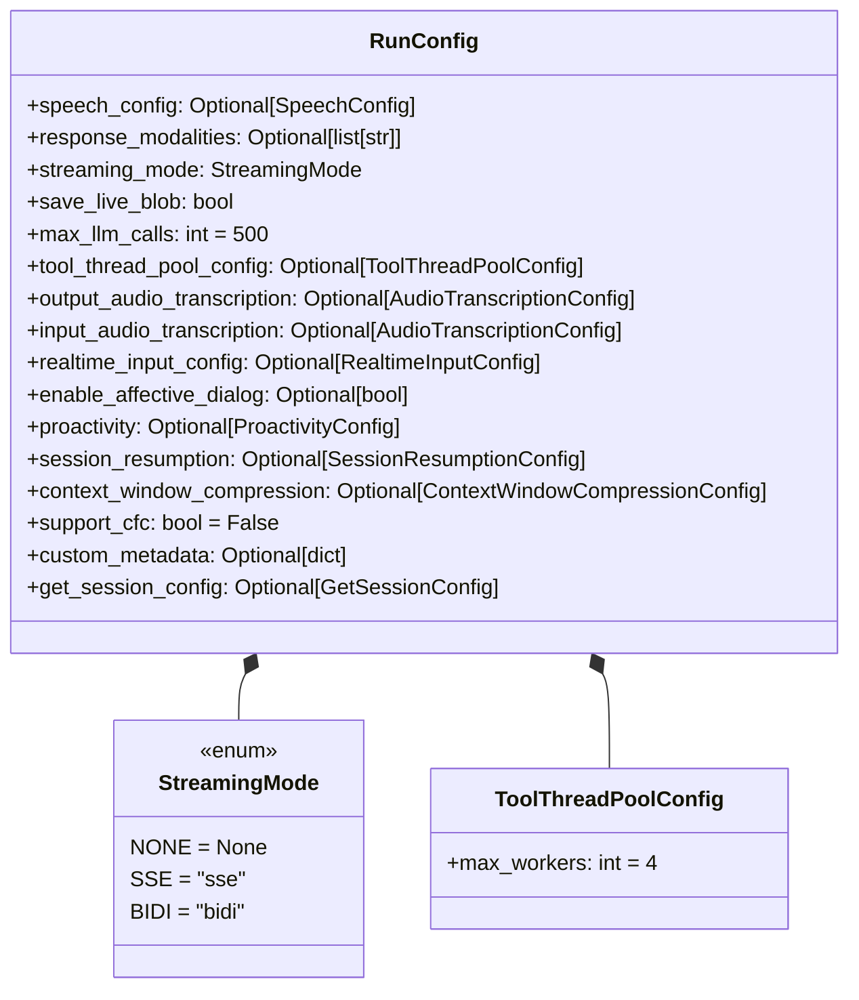
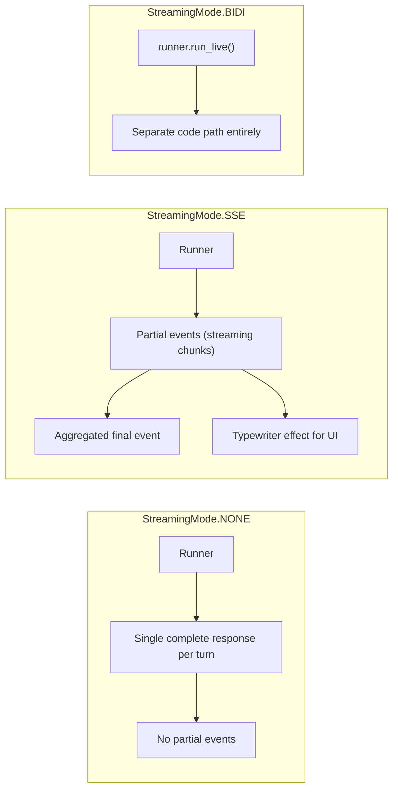
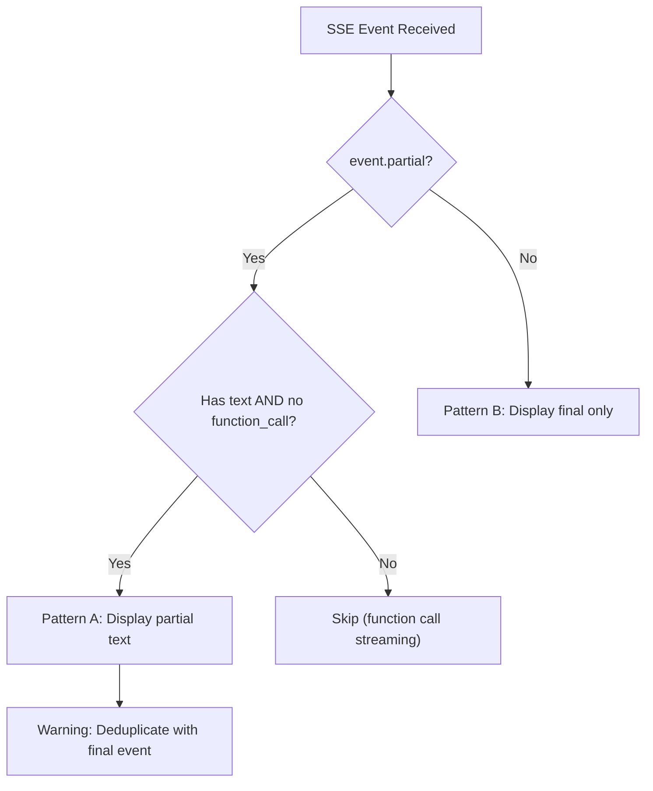
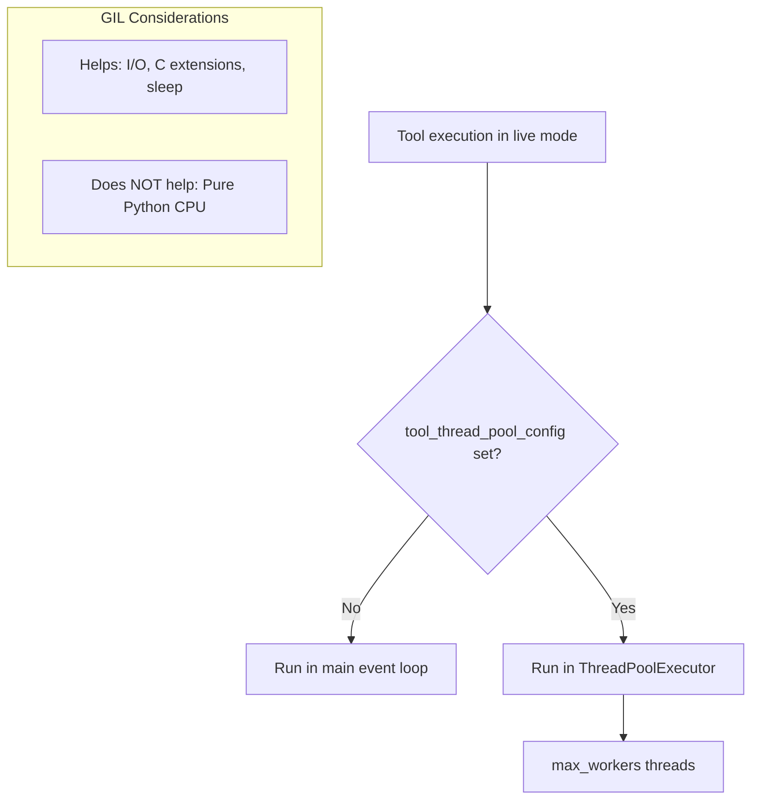
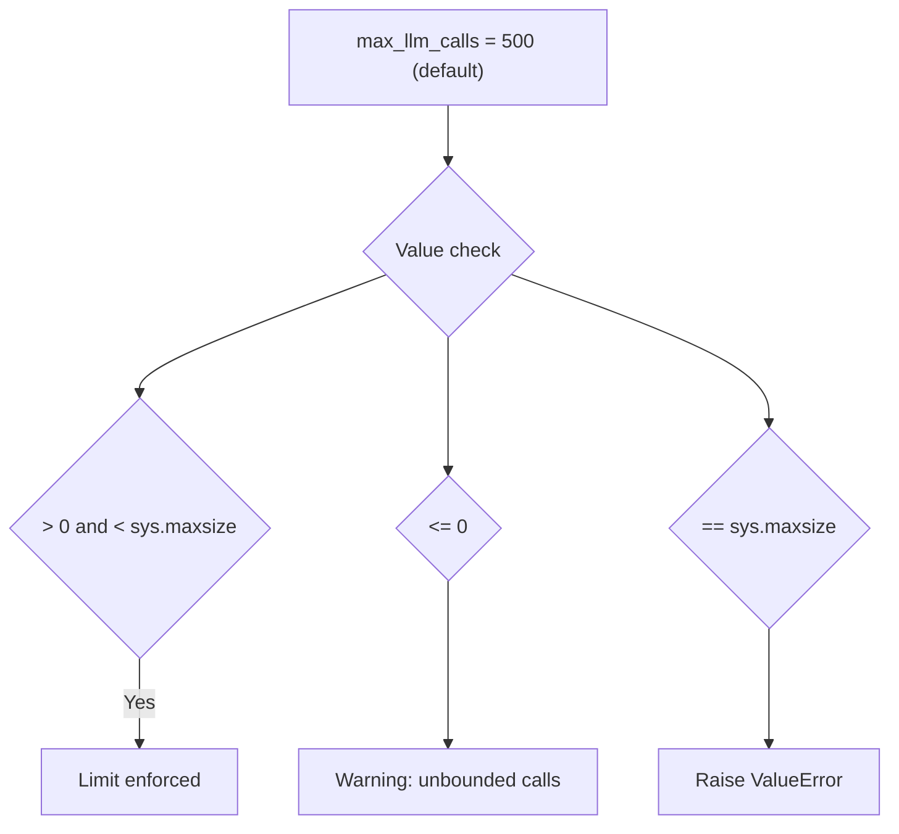

# RunConfig — Runtime Behavior Configuration

**Source:** `src/google/adk/agents/run_config.py`

## Purpose

`RunConfig` provides runtime configuration for agent execution — streaming modes, LLM call limits, speech settings, thread pool configuration for tools, and session management. It is passed through `InvocationContext` and controls how the runner orchestrates agent execution.

## Class Overview

## Streaming Modes

### SSE Event Types

| Event Type | `event.partial` | Content | Display? |
|-----------|----------------|---------|----------|
| Partial text | `True` | Streaming text chunk | Yes (typewriter) |
| Partial function call | `True` | Function call args building | No (internal) |
| Aggregated final | `False` | Complete response | Depends on pattern |

### SSE Display Patterns

## Tool Thread Pool

## LLM Call Limit

The limit is enforced by `InvocationContext._InvocationCostManager`, which raises `LlmCallsLimitExceededError` when exceeded.

## Configuration Fields Summary

| Field | Default | Purpose |
|-------|---------|---------|
| `streaming_mode` | `NONE` | Event streaming behavior |
| `max_llm_calls` | `500` | Safety limit on LLM calls per invocation |
| `speech_config` | `None` | Voice configuration for live agents |
| `response_modalities` | `None` | Output modalities (default: AUDIO for live) |
| `save_live_blob` | `False` | Save audio/video to session + artifacts |
| `tool_thread_pool_config` | `None` | Thread pool for tool execution |
| `support_cfc` | `False` | Compositional Function Calling (experimental) |
| `enable_affective_dialog` | `None` | Emotion-aware responses |
| `proactivity` | `None` | Model proactivity configuration |
| `session_resumption` | `None` | Transparent session resumption |
| `context_window_compression` | `None` | LLM input compression |
| `get_session_config` | `None` | Control event fetching on session load |
| `custom_metadata` | `None` | User-defined metadata for the invocation |

## Deprecated Fields

| Field | Replacement |
|-------|-------------|
| `save_live_audio` | `save_live_blob` |
| `save_input_blobs_as_artifacts` | `SaveFilesAsArtifactsPlugin` |

The `check_for_deprecated_save_live_audio` model validator auto-migrates `save_live_audio` to `save_live_blob`.
