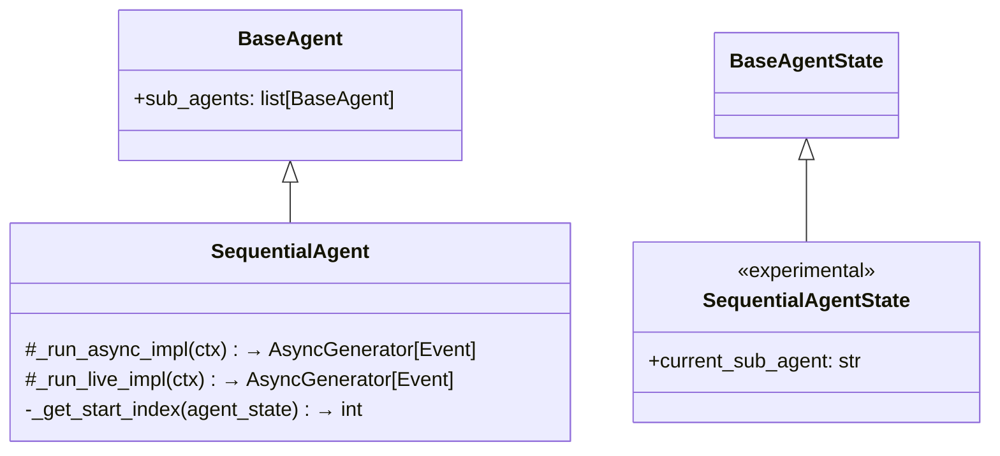
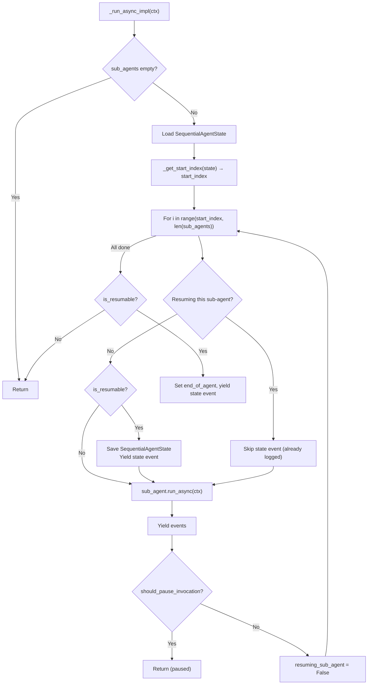
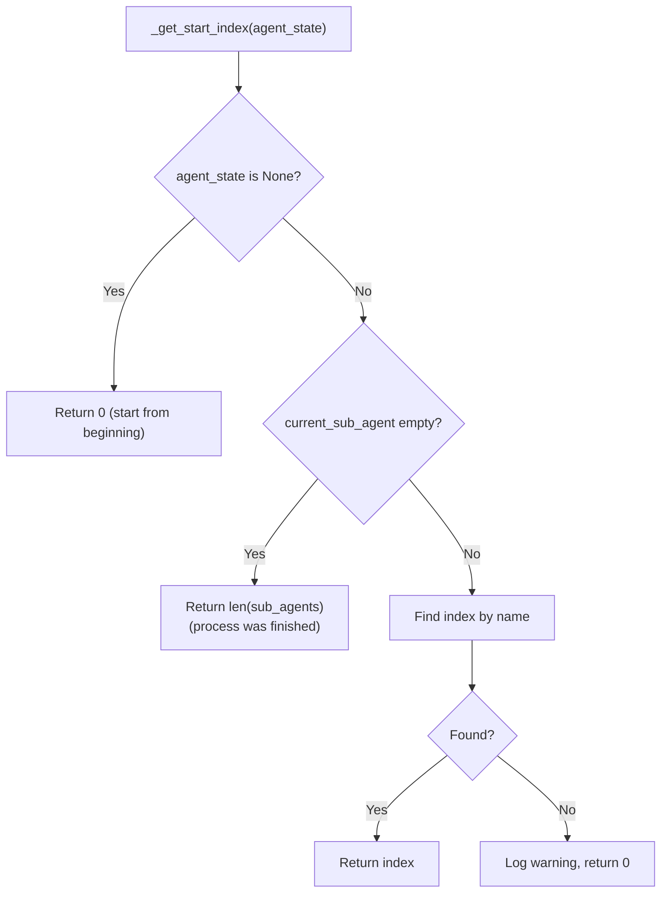
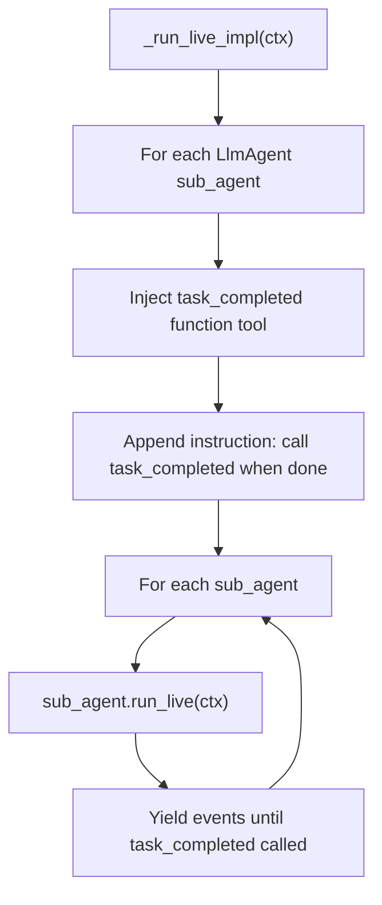
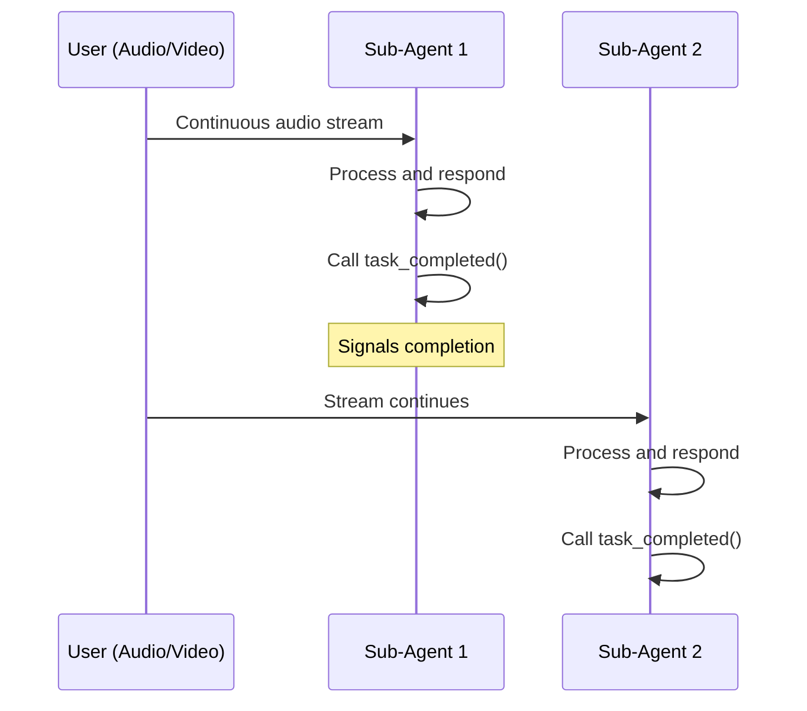
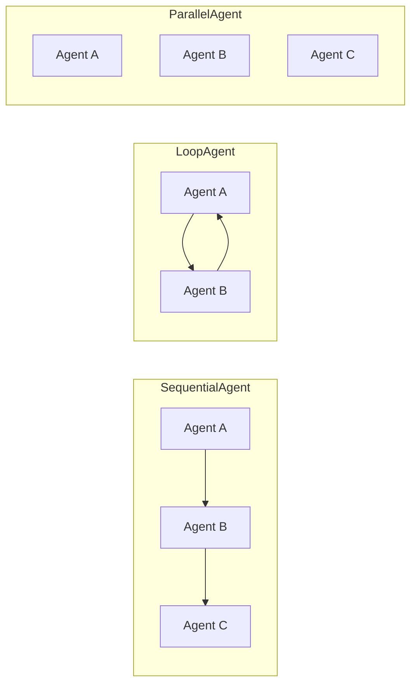

# SequentialAgent — Ordered Sub-Agent Pipeline

**Source:** `src/google/adk/agents/sequential_agent.py`

## Purpose

`SequentialAgent` runs its sub-agents one after another in order. It supports resumable execution, pausing at long-running tools, and a special live mode where each sub-agent signals completion via a `task_completed()` tool.

## Class Overview

## Async Execution Flow

## Resume Logic

## Live Mode — `task_completed()` Pattern

In live (bidirectional streaming) mode, there's no natural end to a sub-agent's turn since audio/video is continuous. The solution: inject a `task_completed()` function tool.

Key details:
- Only `LlmAgent` sub-agents get the tool (checked via `isinstance`)
- Tool is deduplicated by function name to avoid double-injection
- Instruction appended tells agent to call `task_completed` when done

## Comparison: Sequential vs Loop vs Parallel

| Feature | SequentialAgent | LoopAgent | ParallelAgent |
|---------|----------------|-----------|---------------|
| Execution order | Fixed, one-by-one | Repeating cycle | Concurrent |
| Termination | All sub-agents complete | Escalation or max iterations | All sub-agents complete |
| Shared context | Yes (same branch) | Yes (same branch) | Isolated branches |
| Resumability | Yes | Yes | Yes |
| Live mode | Yes (with task_completed) | No | No |
